# CloudWire

Scan your AWS account and visualize resource dependencies as an interactive graph — directly in your browser, running entirely on your local machine.

No data leaves your system. AWS credentials never leave your terminal. The graph is built locally using your existing credential chain (`~/.aws/credentials`, `aws sso login`, `saml2aws`, `aws-vault` — all work out of the box).

<p align="center">
  
</p>

---

## Install

```bash
pip install cloudwire
cloudwire
```

That's it. The browser opens automatically at `http://localhost:8080`.

> **Requirements:** Python 3.9+ and valid AWS credentials configured locally.

---

## What it looks like

- Dark hacker-aesthetic graph canvas with animated data flow
- 24 AWS services with dedicated icons, colors, and role badges
- Edges represent real relationships — API integrations, event triggers, IAM policy inference, env var references
- Four layout modes — Circular (default), Flow, Swimlane — switchable from the graph toolbar
- VPC network topology with CloudMapper-style diagrams — internet anchors, SG rule edges with port labels, AZ grouping, collapsible containers
- Tag-based scanning — discover and scan resources by AWS tags with searchable multi-select dropdowns
- Click any node to inspect its attributes, incoming/outgoing edges, and resource-specific tooltip
- Search, filter by service, highlight upstream/downstream blast radius, find shortest path
- Permission errors surfaced clearly — see exactly which IAM policies are missing

---

## Supported services

| Service | Scanner |
|---------|---------|
| API Gateway | Dedicated — REST + HTTP APIs, multi-service integrations, Cognito authorizers |
| Lambda | Dedicated — functions, event source mappings, env var references, IAM policy inference |
| SQS | Dedicated — queues, attributes, dead letter queue edges |
| SNS | Dedicated — topics and subscriptions |
| EventBridge | Dedicated — rules and targets |
| DynamoDB | Dedicated — tables, streams, global table replicas |
| EC2 | Dedicated — instances, VPC, subnet, security group, instance profile edges |
| ECS | Dedicated — clusters, services, task definitions, load balancer edges |
| S3 | Dedicated — buckets and Lambda notification edges |
| RDS | Dedicated — DB instances and clusters |
| Step Functions | Dedicated |
| Kinesis | Dedicated |
| IAM | Dedicated — roles with full policy resolution |
| Cognito | Dedicated — user pools |
| CloudFront | Dedicated — distributions, S3/API GW/ELB origins, Lambda@Edge |
| Route 53 | Dedicated — hosted zones, record sets, alias target edges |
| ElastiCache | Dedicated — cache clusters |
| Redshift | Dedicated — clusters |
| Glue | Dedicated — jobs, crawlers, triggers |
| AppSync | Dedicated — GraphQL APIs |
| Secrets Manager | Dedicated |
| KMS | Dedicated |
| VPC Network | Dedicated — VPCs, subnets, security groups, IGWs, NAT GWs, route tables; scoped to referenced VPCs |
| ELB | Discovered via CloudFront, Route 53, ECS edges |
| Everything else | Generic (tagged resources only) |

---

## Project structure

```
cloudwire/                        # Python package (the distributable unit)
├── __init__.py                 # Package version
├── cli.py                      # `cloudwire` CLI entry point (click)
├── static/                     # Built React app (populated by `make build`)
│   ├── index.html
│   └── assets/
└── app/                        # FastAPI backend
    ├── main.py                 # App factory, API routes (/api/*), static serving
    ├── models.py               # Pydantic request/response models
    ├── services.py             # Canonical service registry — single source of truth
    ├── scanner.py              # Scan orchestrator, shared helpers, mixin composition
    ├── scanners/               # Per-service scanner modules (mixin classes)
    │   ├── _utils.py           # Shared constants (ARN pattern, env var conventions)
    │   ├── apigateway.py       # REST + HTTP APIs, integrations, authorizers
    │   ├── lambda_.py          # Functions, event sources, IAM policy inference
    │   ├── vpc.py              # VPCs, subnets, SGs, IGWs, NATs, route tables
    │   ├── glue.py             # Jobs, crawlers, triggers
    │   └── ...                 # 16 more service scanners (one per AWS service)
    ├── scan_jobs.py            # Async job store with progress tracking
    └── graph_store.py          # networkx graph with thread-safe mutations

frontend/                       # React + Vite source (compiled into cloudwire/static/)
├── src/
│   ├── pages/CloudWirePage.jsx # Main page — orchestrates all state
│   ├── components/
│   │   ├── graph/              # GraphCanvas, GraphNode, GraphEdge, Minimap, Legend
│   │   ├── layout/             # TopBar, ServiceSidebar, InspectorPanel, TagFilterBar
│   │   └── ErrorBoundary.jsx   # React error boundary for graceful pane crashes
│   ├── hooks/
│   │   ├── useScanPolling.js   # Scan lifecycle, polling, graph data state
│   │   ├── useTagDiscovery.js  # Tag-based resource discovery
│   │   ├── useGraphPipeline.js # Graph filtering, clustering, layout pipeline
│   │   ├── usePathFinder.js    # Shortest-path mode state management
│   │   ├── useClickOutside.js  # Shared click-outside hook
│   │   └── useGraphViewport.js # Pan/zoom viewport state
│   ├── lib/
│   │   ├── graphTransforms.js  # Layout algorithms, annotations, container collapse
│   │   ├── serviceVisuals.jsx  # Service icon + color map
│   │   └── awsRegions.js       # AWS region list
│   └── styles/graph.css        # All UI styles
├── vite.config.js              # base: "./", outDir: ../cloudwire/static, dev proxy
└── package.json

.github/workflows/publish.yml   # CI: build + publish to PyPI on version tag push
pyproject.toml                  # Package metadata, dependencies, entry point
Makefile                        # make build / make dev / make clean
.python-version                 # Pins Python 3.11 for consistent builds
```

---

## Contributing

### Prerequisites

- Python 3.9+ (3.11 recommended)
- Node.js 18+
- AWS credentials configured (any method)

### Set up the dev environment

```bash
git clone https://github.com/hisingh_gwre/cloudwire
cd cloudwire

# Python
python3 -m venv .venv
source .venv/bin/activate
pip install -e .

# Frontend
cd frontend && npm install
```

### Run in development mode

```bash
make dev
```

This starts the FastAPI backend on `:8000` (with `--reload`) and the Vite dev server on `:5173` concurrently. The Vite dev server proxies all `/api/*` requests to the backend — no CORS config needed.

### Making changes

| Area | Where to edit |
|------|--------------|
| Add a new AWS service scanner | `cloudwire/app/scanners/` → create a mixin class, import it in `scanner.py`, add to the class bases and `service_scanners` dict |
| Change graph layout | `frontend/src/lib/graphTransforms.js` |
| Add a new UI component | `frontend/src/components/` |
| Change API routes | `cloudwire/app/main.py` — all routes are under the `/api` prefix |
| Change CLI options | `cloudwire/cli.py` |

### Before opening a PR

- Run a scan against a real (or mocked) AWS account and confirm the graph renders
- Make sure `make build` completes without errors
- Keep PRs focused — one feature or fix per PR

### Code style

- Python: standard library imports first, then third-party, then local. No formatter enforced yet.
- JavaScript: no linter enforced yet. Match the style of the surrounding file.

---

## Links

- [Full feature list](docs/FEATURES.md)
- [Usage & setup guide](docs/USAGE.md)
- [Release guide for maintainers](docs/RELEASING.md)
